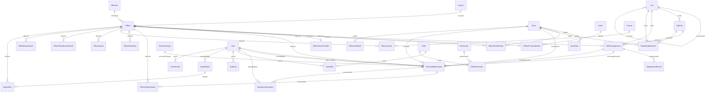

# Database relationships

Proposed design; no migrations have been applied. Nullable references permit incomplete legacy records. All deletion actions restrict dependent record removal.

```mermaid
erDiagram
    County ||--o{ Officer : countyId
    Ethnicity ||--o{ Officer : ethnicityId
    Officer ||--o| OfficerServiceProfile : officerId
    Rank ||--o{ RankAlias : rankId
    Officer ||--o{ OfficerRankHistory : officerId
    Rank ||--o{ OfficerRankHistory : rankId
    Officer ||--o| OfficerFinancialDetail : officerId
    Bank ||--o{ OfficerFinancialDetail : bankId
    Unit ||--o{ Unit : parentUnitId
    Unit ||--o{ SubUnit : unitId
    Officer ||--o{ OfficerAssignment : officerId
    Unit ||--o{ OfficerAssignment : unitId
    SubUnit ||--o{ OfficerAssignment : subUnitId
    OfficerAssignment ||--o{ DeploymentRecord : assignmentId
    Unit ||--o{ RankEstablishment : unitId
    SubUnit ||--o{ RankEstablishment : subUnitId
    Rank ||--o{ RankEstablishment : rankId
    Officer ||--o{ PersonnelMovement : officerId
    MovementType ||--o{ PersonnelMovement : movementTypeId
    OfficerAssignment ||--o{ PersonnelMovement : fromAssignmentId
    OfficerAssignment ||--o{ PersonnelMovement : toAssignmentId
    Rank ||--o{ PersonnelMovement : fromRankId
    Rank ||--o{ PersonnelMovement : toRankId
    User ||--o{ PersonnelMovement : recordedById
    User ||--o{ PersonnelMovement : approvedById
    Officer ||--o{ OfficerStatusHistory : officerId
    PersonnelMovement ||--o{ OfficerStatusHistory : movementId
    PersonnelMovement ||--o{ MovementDocument : movementId
    User ||--o{ MovementDocument : uploadedById
    Officer ||--o{ OfficerEducation : officerId
    Officer ||--o{ OfficerCourse : officerId
    Course ||--o{ OfficerCourse : courseId
    Officer ||--o{ OfficerAward : officerId
    Officer ||--o{ OfficerDisciplinaryRecord : officerId
    Officer ||--o{ OfficerExamination : officerId
    User ||--o{ UserRole : userId
    Role ||--o{ UserRole : roleId
    Role ||--o{ RolePermission : roleId
    Permission ||--o{ RolePermission : permissionId
    User ||--o{ AuditLog : userId
    Rank ||--o{ RetirementRule : rankId
    User ||--o{ ImportBatch : uploadedById
    ImportBatch ||--o{ ImportRow : batchId
    Officer ||--o{ ImportRow : officerId
    User ||--o{ UserSession : userId
```
